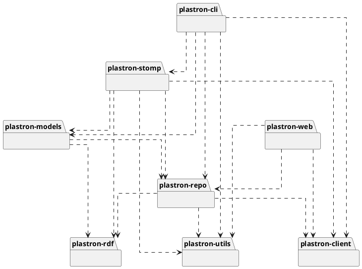

# Architecture

Plastron is structured as a set of Python [distribution packages], each of 
which contributes modules to the `plastron` [namespace package]. These 
distribution packages go from having no requirements other than the Python 
standard library plus some well-known third-party packages all the way up 
to applications that require all the other Plastron distribution packages,
either directly or indirectly.

## Distribution Packages

- **plastron-utils:** Basic utility functions and classes
- **plastron-rdf:** RDF-to-Python object mapping
- **plastron-client:** HTTP connections, authentication, and Fedora 
  transactions
- **plastron-repo:** High-level repository operation and job handling
- **plastron-models:** Descriptive metadata content models, binary file 
  models, RDF namespace convenience functions, serializers, and validation 
  functions
- **plastron-cli:** Command line application
- **plastron-stomp:** STOMP application
- **plastron-web:** HTTP server application

## Distribution Package Structure

Each distribution package contains:

- A `src` directory, containing a `plastron` directory that is serving as a 
  [namespace package]. Thus `src/plastron` should *never* directly contain 
  an `__init__.py` file. Within `src/plastron`, there will be one or more 
  [import packages]
- A `tests` directory for the [pytest] tests for this package
- A `pyproject.toml` file listing the name, version, and dependencies for 
  this package. Note that currently, the other `plastron-*` distribution 
  packages are omitted from this dependency list, as there is not 
  currently a way to specify a relative local path in `pyproject.toml`. 

[distribution packages]: https://packaging.python.org/en/latest/glossary/#term-Distribution-Package
[namespace package]: https://packaging.python.org/en/latest/guides/packaging-namespace-packages/
[import packages]: https://packaging.python.org/en/latest/glossary/#term-Import-Package
[pytest]: https://docs.pytest.org/